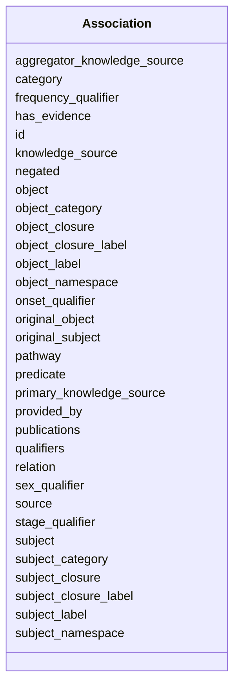

# Class: Association


URI: [https://w3id.org/monarch/monarch-py/:Association](https://w3id.org/monarch/monarch-py/:Association)





<!-- no inheritance hierarchy -->


## Slots

| Name | Cardinality and Range | Description | Inheritance |
| ---  | --- | --- | --- |
| [aggregator_knowledge_source](aggregator_knowledge_source.md) | 0..* <br/> [xsd:string](xsd:string) |  | direct |
| [id](id.md) | 1..1 <br/> [xsd:string](xsd:string) |  | direct |
| [subject](subject.md) | 0..1 <br/> [xsd:string](xsd:string) |  | direct |
| [original_subject](original_subject.md) | 0..1 <br/> [xsd:string](xsd:string) |  | direct |
| [subject_namespace](subject_namespace.md) | 0..1 <br/> [xsd:string](xsd:string) |  | direct |
| [subject_category](subject_category.md) | 0..* <br/> [xsd:string](xsd:string) |  | direct |
| [subject_closure](subject_closure.md) | 0..* <br/> [xsd:string](xsd:string) |  | direct |
| [subject_label](subject_label.md) | 0..1 <br/> [xsd:string](xsd:string) |  | direct |
| [subject_closure_label](subject_closure_label.md) | 0..* <br/> [xsd:string](xsd:string) |  | direct |
| [predicate](predicate.md) | 0..1 <br/> [xsd:string](xsd:string) |  | direct |
| [object](object.md) | 0..1 <br/> [xsd:string](xsd:string) |  | direct |
| [original_object](original_object.md) | 0..1 <br/> [xsd:string](xsd:string) |  | direct |
| [object_namespace](object_namespace.md) | 0..1 <br/> [xsd:string](xsd:string) |  | direct |
| [object_category](object_category.md) | 0..* <br/> [xsd:string](xsd:string) |  | direct |
| [object_closure](object_closure.md) | 0..* <br/> [xsd:string](xsd:string) |  | direct |
| [object_label](object_label.md) | 0..1 <br/> [xsd:string](xsd:string) |  | direct |
| [object_closure_label](object_closure_label.md) | 0..* <br/> [xsd:string](xsd:string) |  | direct |
| [knowledge_source](knowledge_source.md) | 0..* <br/> [xsd:string](xsd:string) |  | direct |
| [primary_knowledge_source](primary_knowledge_source.md) | 0..* <br/> [xsd:string](xsd:string) |  | direct |
| [category](category.md) | 0..* <br/> [xsd:string](xsd:string) |  | direct |
| [negated](negated.md) | 0..1 <br/> [xsd:boolean](xsd:boolean) |  | direct |
| [provided_by](provided_by.md) | 0..1 <br/> [xsd:string](xsd:string) |  | direct |
| [publications](publications.md) | 0..* <br/> [xsd:string](xsd:string) |  | direct |
| [qualifiers](qualifiers.md) | 0..* <br/> [xsd:string](xsd:string) |  | direct |
| [frequency_qualifier](frequency_qualifier.md) | 0..1 <br/> [xsd:string](xsd:string) |  | direct |
| [has_evidence](has_evidence.md) | 0..1 <br/> [xsd:string](xsd:string) |  | direct |
| [onset_qualifier](onset_qualifier.md) | 0..1 <br/> [xsd:string](xsd:string) |  | direct |
| [sex_qualifier](sex_qualifier.md) | 0..1 <br/> [xsd:string](xsd:string) |  | direct |
| [source](source.md) | 0..1 <br/> [xsd:string](xsd:string) |  | direct |
| [stage_qualifier](stage_qualifier.md) | 0..1 <br/> [xsd:string](xsd:string) |  | direct |
| [pathway](pathway.md) | 0..1 <br/> [xsd:string](xsd:string) |  | direct |
| [relation](relation.md) | 0..1 <br/> [xsd:string](xsd:string) |  | direct |


## Usages

| used by | used in | type | used |
| ---  | --- | --- | --- |
| [AssociationResults](AssociationResults.md) | [associations](associations.md) | range | [Association](Association.md) |


## Identifier and Mapping Information


### Schema Source


* from schema: https://w3id.org/monarch/monarch-py


## Mappings

| Mapping Type | Mapped Value |
| ---  | ---  |
| self | https://w3id.org/monarch/monarch-py/:Association |
| native | https://w3id.org/monarch/monarch-py/:Association |


## LinkML Source

<!-- TODO: investigate https://stackoverflow.com/questions/37606292/how-to-create-tabbed-code-blocks-in-mkdocs-or-sphinx -->

### Direct

<details>
```yaml
name: Association
from_schema: https://w3id.org/monarch/monarch-py
rank: 1000
slots:
- aggregator_knowledge_source
- id
- subject
- original_subject
- subject_namespace
- subject_category
- subject_closure
- subject_label
- subject_closure_label
- predicate
- object
- original_object
- object_namespace
- object_category
- object_closure
- object_label
- object_closure_label
- knowledge_source
- primary_knowledge_source
- category
- negated
- provided_by
- publications
- qualifiers
- frequency_qualifier
- has_evidence
- onset_qualifier
- sex_qualifier
- source
- stage_qualifier
- pathway
- relation

```
</details>

### Induced

<details>
```yaml
name: Association
from_schema: https://w3id.org/monarch/monarch-py
rank: 1000
attributes:
  aggregator_knowledge_source:
    name: aggregator_knowledge_source
    from_schema: https://w3id.org/monarch/monarch-py
    rank: 1000
    multivalued: true
    alias: aggregator_knowledge_source
    owner: Association
    domain_of:
    - Association
    range: string
  id:
    name: id
    from_schema: https://w3id.org/monarch/monarch-py
    rank: 1000
    identifier: true
    alias: id
    owner: Association
    domain_of:
    - Association
    - Entity
    range: string
  subject:
    name: subject
    from_schema: https://w3id.org/monarch/monarch-py
    rank: 1000
    alias: subject
    owner: Association
    domain_of:
    - Association
    range: string
  original_subject:
    name: original_subject
    from_schema: https://w3id.org/monarch/monarch-py
    rank: 1000
    alias: original_subject
    owner: Association
    domain_of:
    - Association
    range: string
  subject_namespace:
    name: subject_namespace
    from_schema: https://w3id.org/monarch/monarch-py
    rank: 1000
    alias: subject_namespace
    owner: Association
    domain_of:
    - Association
    range: string
  subject_category:
    name: subject_category
    from_schema: https://w3id.org/monarch/monarch-py
    rank: 1000
    multivalued: true
    alias: subject_category
    owner: Association
    domain_of:
    - Association
    range: string
  subject_closure:
    name: subject_closure
    from_schema: https://w3id.org/monarch/monarch-py
    rank: 1000
    multivalued: true
    alias: subject_closure
    owner: Association
    domain_of:
    - Association
    range: string
  subject_label:
    name: subject_label
    from_schema: https://w3id.org/monarch/monarch-py
    rank: 1000
    alias: subject_label
    owner: Association
    domain_of:
    - Association
    range: string
  subject_closure_label:
    name: subject_closure_label
    from_schema: https://w3id.org/monarch/monarch-py
    rank: 1000
    multivalued: true
    alias: subject_closure_label
    owner: Association
    domain_of:
    - Association
    range: string
  predicate:
    name: predicate
    from_schema: https://w3id.org/monarch/monarch-py
    rank: 1000
    multivalued: false
    alias: predicate
    owner: Association
    domain_of:
    - Association
    range: string
  object:
    name: object
    from_schema: https://w3id.org/monarch/monarch-py
    rank: 1000
    alias: object
    owner: Association
    domain_of:
    - Association
    range: string
  original_object:
    name: original_object
    from_schema: https://w3id.org/monarch/monarch-py
    rank: 1000
    alias: original_object
    owner: Association
    domain_of:
    - Association
    range: string
  object_namespace:
    name: object_namespace
    from_schema: https://w3id.org/monarch/monarch-py
    rank: 1000
    alias: object_namespace
    owner: Association
    domain_of:
    - Association
    range: string
  object_category:
    name: object_category
    from_schema: https://w3id.org/monarch/monarch-py
    rank: 1000
    multivalued: true
    alias: object_category
    owner: Association
    domain_of:
    - Association
    range: string
  object_closure:
    name: object_closure
    from_schema: https://w3id.org/monarch/monarch-py
    rank: 1000
    multivalued: true
    alias: object_closure
    owner: Association
    domain_of:
    - Association
    range: string
  object_label:
    name: object_label
    from_schema: https://w3id.org/monarch/monarch-py
    rank: 1000
    alias: object_label
    owner: Association
    domain_of:
    - Association
    range: string
  object_closure_label:
    name: object_closure_label
    from_schema: https://w3id.org/monarch/monarch-py
    rank: 1000
    multivalued: true
    alias: object_closure_label
    owner: Association
    domain_of:
    - Association
    range: string
  knowledge_source:
    name: knowledge_source
    from_schema: https://w3id.org/monarch/monarch-py
    rank: 1000
    multivalued: true
    alias: knowledge_source
    owner: Association
    domain_of:
    - Association
    range: string
  primary_knowledge_source:
    name: primary_knowledge_source
    from_schema: https://w3id.org/monarch/monarch-py
    rank: 1000
    multivalued: true
    alias: primary_knowledge_source
    owner: Association
    domain_of:
    - Association
    range: string
  category:
    name: category
    from_schema: https://w3id.org/monarch/monarch-py
    rank: 1000
    multivalued: true
    alias: category
    owner: Association
    domain_of:
    - Association
    - Entity
    range: string
  negated:
    name: negated
    from_schema: https://w3id.org/monarch/monarch-py
    rank: 1000
    alias: negated
    owner: Association
    domain_of:
    - Association
    range: boolean
  provided_by:
    name: provided_by
    from_schema: https://w3id.org/monarch/monarch-py
    rank: 1000
    alias: provided_by
    owner: Association
    domain_of:
    - Association
    - Entity
    range: string
  publications:
    name: publications
    from_schema: https://w3id.org/monarch/monarch-py
    rank: 1000
    multivalued: true
    alias: publications
    owner: Association
    domain_of:
    - Association
    range: string
  qualifiers:
    name: qualifiers
    from_schema: https://w3id.org/monarch/monarch-py
    rank: 1000
    multivalued: true
    alias: qualifiers
    owner: Association
    domain_of:
    - Association
    range: string
  frequency_qualifier:
    name: frequency_qualifier
    from_schema: https://w3id.org/monarch/monarch-py
    rank: 1000
    alias: frequency_qualifier
    owner: Association
    domain_of:
    - Association
    range: string
  has_evidence:
    name: has_evidence
    from_schema: https://w3id.org/monarch/monarch-py
    rank: 1000
    alias: has_evidence
    owner: Association
    domain_of:
    - Association
    range: string
  onset_qualifier:
    name: onset_qualifier
    from_schema: https://w3id.org/monarch/monarch-py
    rank: 1000
    alias: onset_qualifier
    owner: Association
    domain_of:
    - Association
    range: string
  sex_qualifier:
    name: sex_qualifier
    from_schema: https://w3id.org/monarch/monarch-py
    rank: 1000
    alias: sex_qualifier
    owner: Association
    domain_of:
    - Association
    range: string
  source:
    name: source
    from_schema: https://w3id.org/monarch/monarch-py
    rank: 1000
    alias: source
    owner: Association
    domain_of:
    - Association
    - Entity
    range: string
  stage_qualifier:
    name: stage_qualifier
    from_schema: https://w3id.org/monarch/monarch-py
    rank: 1000
    alias: stage_qualifier
    owner: Association
    domain_of:
    - Association
    range: string
  pathway:
    name: pathway
    from_schema: https://w3id.org/monarch/monarch-py
    rank: 1000
    alias: pathway
    owner: Association
    domain_of:
    - Association
    range: string
  relation:
    name: relation
    from_schema: https://w3id.org/monarch/monarch-py
    rank: 1000
    alias: relation
    owner: Association
    domain_of:
    - Association
    range: string

```
</details>