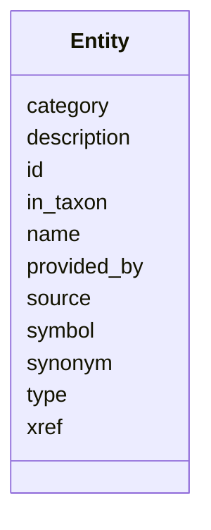

# Class: Entity


URI: [https://w3id.org/monarch/monarch-py/:Entity](https://w3id.org/monarch/monarch-py/:Entity)





<!-- no inheritance hierarchy -->


## Slots

| Name | Cardinality and Range | Description | Inheritance |
| ---  | --- | --- | --- |
| [id](id.md) | 1..1 <br/> [xsd:string](xsd:string) |  | direct |
| [category](category.md) | 0..* <br/> [xsd:string](xsd:string) |  | direct |
| [name](name.md) | 0..1 <br/> [xsd:string](xsd:string) |  | direct |
| [description](description.md) | 0..1 <br/> [xsd:string](xsd:string) |  | direct |
| [xref](xref.md) | 0..* <br/> [xsd:string](xsd:string) |  | direct |
| [provided_by](provided_by.md) | 0..1 <br/> [xsd:string](xsd:string) |  | direct |
| [in_taxon](in_taxon.md) | 0..1 <br/> [xsd:string](xsd:string) |  | direct |
| [source](source.md) | 0..1 <br/> [xsd:string](xsd:string) |  | direct |
| [symbol](symbol.md) | 0..1 <br/> [xsd:string](xsd:string) |  | direct |
| [type](type.md) | 0..1 <br/> [xsd:string](xsd:string) |  | direct |
| [synonym](synonym.md) | 0..* <br/> [xsd:string](xsd:string) |  | direct |


## Usages

| used by | used in | type | used |
| ---  | --- | --- | --- |
| [EntityResults](EntityResults.md) | [entities](entities.md) | range | [Entity](Entity.md) |


## Identifier and Mapping Information


### Schema Source


* from schema: https://w3id.org/monarch/monarch-py


## Mappings

| Mapping Type | Mapped Value |
| ---  | ---  |
| self | https://w3id.org/monarch/monarch-py/:Entity |
| native | https://w3id.org/monarch/monarch-py/:Entity |


## LinkML Source

<!-- TODO: investigate https://stackoverflow.com/questions/37606292/how-to-create-tabbed-code-blocks-in-mkdocs-or-sphinx -->

### Direct

<details>
```yaml
name: Entity
from_schema: https://w3id.org/monarch/monarch-py
rank: 1000
slots:
- id
- category
- name
- description
- xref
- provided_by
- in_taxon
- source
- symbol
- type
- synonym

```
</details>

### Induced

<details>
```yaml
name: Entity
from_schema: https://w3id.org/monarch/monarch-py
rank: 1000
attributes:
  id:
    name: id
    from_schema: https://w3id.org/monarch/monarch-py
    rank: 1000
    identifier: true
    alias: id
    owner: Entity
    domain_of:
    - Association
    - Entity
    range: string
  category:
    name: category
    from_schema: https://w3id.org/monarch/monarch-py
    rank: 1000
    multivalued: true
    alias: category
    owner: Entity
    domain_of:
    - Association
    - Entity
    range: string
  name:
    name: name
    from_schema: https://w3id.org/monarch/monarch-py
    rank: 1000
    alias: name
    owner: Entity
    domain_of:
    - Entity
    range: string
  description:
    name: description
    from_schema: https://w3id.org/monarch/monarch-py
    rank: 1000
    alias: description
    owner: Entity
    domain_of:
    - Entity
    range: string
  xref:
    name: xref
    from_schema: https://w3id.org/monarch/monarch-py
    rank: 1000
    multivalued: true
    alias: xref
    owner: Entity
    domain_of:
    - Entity
    range: string
  provided_by:
    name: provided_by
    from_schema: https://w3id.org/monarch/monarch-py
    rank: 1000
    alias: provided_by
    owner: Entity
    domain_of:
    - Association
    - Entity
    range: string
  in_taxon:
    name: in_taxon
    from_schema: https://w3id.org/monarch/monarch-py
    rank: 1000
    alias: in_taxon
    owner: Entity
    domain_of:
    - Entity
    range: string
  source:
    name: source
    from_schema: https://w3id.org/monarch/monarch-py
    rank: 1000
    alias: source
    owner: Entity
    domain_of:
    - Association
    - Entity
    range: string
  symbol:
    name: symbol
    from_schema: https://w3id.org/monarch/monarch-py
    rank: 1000
    alias: symbol
    owner: Entity
    domain_of:
    - Entity
    range: string
  type:
    name: type
    from_schema: https://w3id.org/monarch/monarch-py
    rank: 1000
    alias: type
    owner: Entity
    domain_of:
    - Entity
    range: string
  synonym:
    name: synonym
    from_schema: https://w3id.org/monarch/monarch-py
    rank: 1000
    multivalued: true
    alias: synonym
    owner: Entity
    domain_of:
    - Entity
    range: string

```
</details>