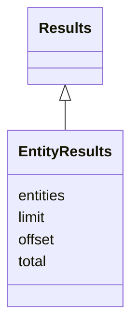

# Class: EntityResults


URI: [https://w3id.org/monarch/monarch-py/:EntityResults](https://w3id.org/monarch/monarch-py/:EntityResults)





## Inheritance
* [Results](Results.md)
    * **EntityResults**


## Slots

| Name | Cardinality and Range | Description | Inheritance |
| ---  | --- | --- | --- |
| [entities](entities.md) | 0..* <br/> [Entity](Entity.md) |  | direct |
| [limit](limit.md) | 0..1 <br/> [xsd:integer](xsd:integer) |  | [Results](Results.md) |
| [offset](offset.md) | 0..1 <br/> [xsd:integer](xsd:integer) |  | [Results](Results.md) |
| [total](total.md) | 0..1 <br/> [xsd:integer](xsd:integer) |  | [Results](Results.md) |


## Identifier and Mapping Information


### Schema Source


* from schema: https://w3id.org/monarch/monarch-py


## Mappings

| Mapping Type | Mapped Value |
| ---  | ---  |
| self | https://w3id.org/monarch/monarch-py/:EntityResults |
| native | https://w3id.org/monarch/monarch-py/:EntityResults |


## LinkML Source

<!-- TODO: investigate https://stackoverflow.com/questions/37606292/how-to-create-tabbed-code-blocks-in-mkdocs-or-sphinx -->

### Direct

<details>
```yaml
name: EntityResults
from_schema: https://w3id.org/monarch/monarch-py
rank: 1000
is_a: Results
slots:
- entities

```
</details>

### Induced

<details>
```yaml
name: EntityResults
from_schema: https://w3id.org/monarch/monarch-py
rank: 1000
is_a: Results
attributes:
  entities:
    name: entities
    from_schema: https://w3id.org/monarch/monarch-py
    rank: 1000
    multivalued: true
    alias: entities
    owner: EntityResults
    domain_of:
    - EntityResults
    range: Entity
    inlined: true
    inlined_as_list: true
  limit:
    name: limit
    from_schema: https://w3id.org/monarch/monarch-py
    rank: 1000
    alias: limit
    owner: EntityResults
    domain_of:
    - Results
    range: integer
  offset:
    name: offset
    from_schema: https://w3id.org/monarch/monarch-py
    rank: 1000
    alias: offset
    owner: EntityResults
    domain_of:
    - Results
    range: integer
  total:
    name: total
    from_schema: https://w3id.org/monarch/monarch-py
    rank: 1000
    alias: total
    owner: EntityResults
    domain_of:
    - Results
    range: integer

```
</details>