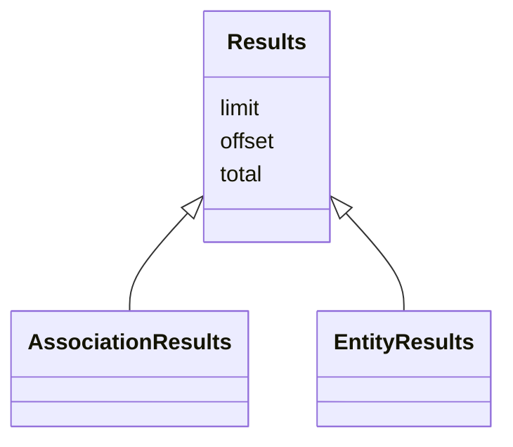

# Class: Results


* __NOTE__: this is an abstract class and should not be instantiated directly


URI: [https://w3id.org/monarch/monarch-py/:Results](https://w3id.org/monarch/monarch-py/:Results)





## Inheritance
* **Results**
    * [AssociationResults](AssociationResults.md)
    * [EntityResults](EntityResults.md)


## Slots

| Name | Cardinality and Range | Description | Inheritance |
| ---  | --- | --- | --- |
| [limit](limit.md) | 0..1 <br/> [xsd:integer](xsd:integer) |  | direct |
| [offset](offset.md) | 0..1 <br/> [xsd:integer](xsd:integer) |  | direct |
| [total](total.md) | 0..1 <br/> [xsd:integer](xsd:integer) |  | direct |


## Identifier and Mapping Information


### Schema Source


* from schema: https://w3id.org/monarch/monarch-py


## Mappings

| Mapping Type | Mapped Value |
| ---  | ---  |
| self | https://w3id.org/monarch/monarch-py/:Results |
| native | https://w3id.org/monarch/monarch-py/:Results |


## LinkML Source

<!-- TODO: investigate https://stackoverflow.com/questions/37606292/how-to-create-tabbed-code-blocks-in-mkdocs-or-sphinx -->

### Direct

<details>
```yaml
name: Results
from_schema: https://w3id.org/monarch/monarch-py
rank: 1000
abstract: true
slots:
- limit
- offset
- total

```
</details>

### Induced

<details>
```yaml
name: Results
from_schema: https://w3id.org/monarch/monarch-py
rank: 1000
abstract: true
attributes:
  limit:
    name: limit
    from_schema: https://w3id.org/monarch/monarch-py
    rank: 1000
    alias: limit
    owner: Results
    domain_of:
    - Results
    range: integer
  offset:
    name: offset
    from_schema: https://w3id.org/monarch/monarch-py
    rank: 1000
    alias: offset
    owner: Results
    domain_of:
    - Results
    range: integer
  total:
    name: total
    from_schema: https://w3id.org/monarch/monarch-py
    rank: 1000
    alias: total
    owner: Results
    domain_of:
    - Results
    range: integer

```
</details>